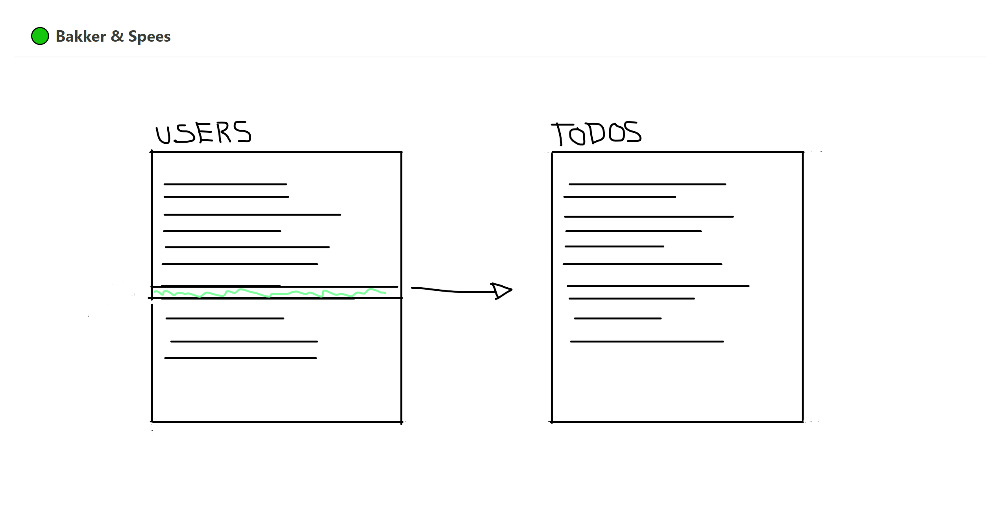

## Assessment Bakker &amp; Spees 
Je gaat een deel van de applicatie bouwen waarin twee lijsten te zien zijn. In de eerste lijst is een overzicht van gebruikers te zien. In de tweede lijst een overzicht van todo's van een specifieke gebruiker. Het idee is dat de lijst met todo's update op het moment dat er op een gebruiker wordt geklikt in de andere lijst.

### Voordat je begint
Deze opdracht niet delen.
Graag binnen de afgesproken tijd terugsturen.

### Getting started
1. Clone deze repository lokaal.
2. Maak de opdracht af. 
3. De opdracht per email inleveren als zip bijlage naar `wadeea@bakkerspees.nl` en `gerko@bakkerspees.nl`.

### Applicatie opstarten
1. installeer de dependencies door `npm i` te runnen
2. start de applicatie met `npm start`

### Opdracht
1. Haal de lijst met gebruikers op van deze [API](https://jsonplaceholder.typicode.com/users)
2. Verwerk de data in een [List component](https://js.devexpress.com/Documentation/ApiReference/UI_Components/dxList/) van DevExtreme
3. Haal hier de lijst met todo's op van deze [API](https://jsonplaceholder.typicode.com/todos)

### Bonus
Als je tijd over hebt, kan je één of meer bonus punten verwerken:
-	Todo’s toevoegen en verwijderen.
-	Gebruiker details weergeven.
-	TypeScript gebruiken om de applicatie te ontwikkelen.
